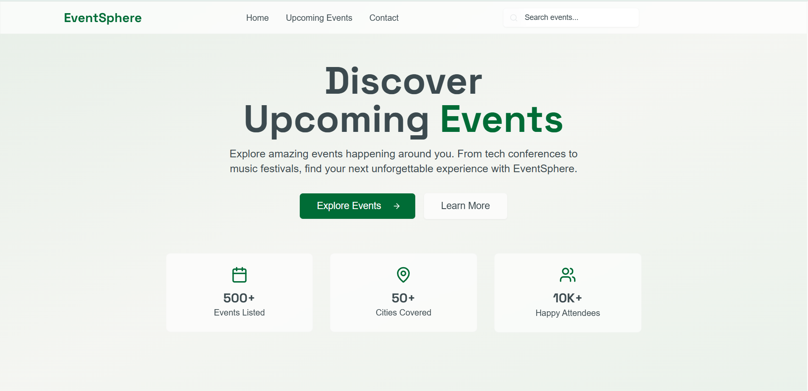
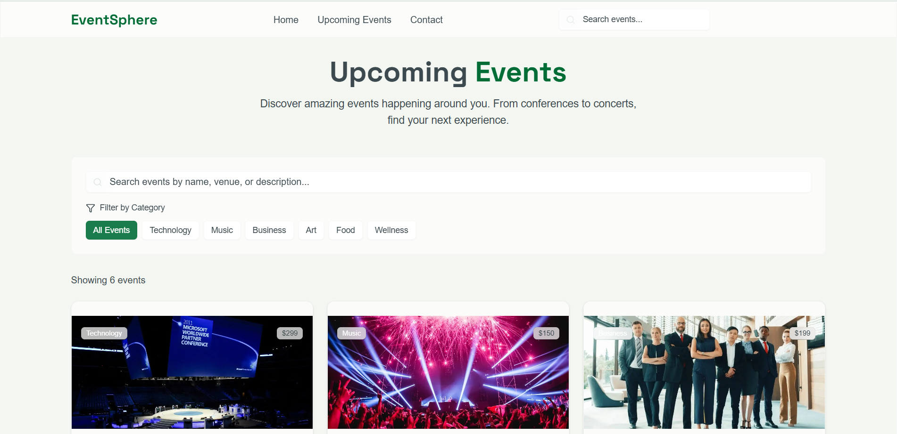

# 🎉 EventSphere  

A sleek and modern **Upcoming Events Website** built with **Next.js**, **Tailwind CSS**, and **shadcn/ui**.  
EventSphere is designed to provide a responsive, user-friendly, and stylish platform to showcase and explore upcoming events. 🚀  

---

## 🌐 Live Demo  
👉 [Click here to view EventSphere Live](https://eventsphere-sigma.vercel.app)  

---

## 📸 Screenshots  

### 🏠 Homepage  
  

### 📅 Events Page  
  

---

## ✨ Features  
- ⚡ **Next.js 14** – App Router, fast rendering & SEO friendly  
- 🎨 **Tailwind CSS** – Utility-first, fully responsive styling  
- 🖼 **shadcn/ui** – Pre-built, customizable UI components  
- 📱 **Responsive Design** – Works seamlessly on all devices  
- 🎯 **Modern UI/UX** – Minimal, clean and event-focused design  

---

## 📂 Project Structure  


EventSphere/
├── app/ # Next.js App Router pages
├── components/ # Reusable UI components
├── styles/ # Global styles
├── public/ # Static assets
└── package.json # Dependencies & scripts

---

## 🚀 Getting Started  

Clone the repo and install dependencies:  

```bash
git clone https://github.com/your-username/eventsphere.git
cd eventsphere
npm install

npm run dev

Open http://localhost:3000
 to see it in action.

🛠 Tech Stack

Next.js

Tailwind CSS

shadcn/ui

🤝 Contributing

Contributions are welcome! If you’d like to improve EventSphere, feel free to fork the repo, submit a pull request, or open an issue.
